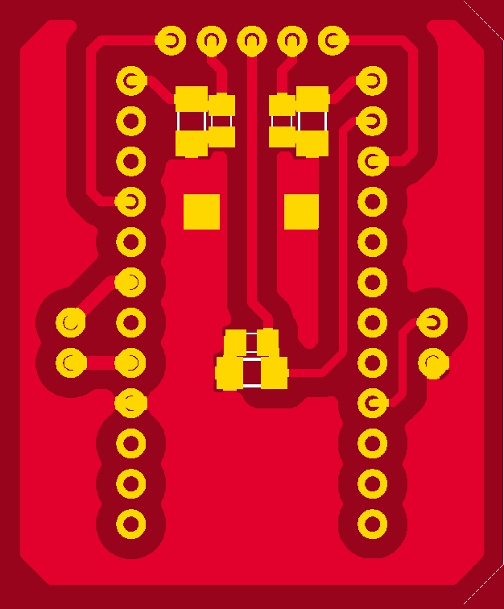
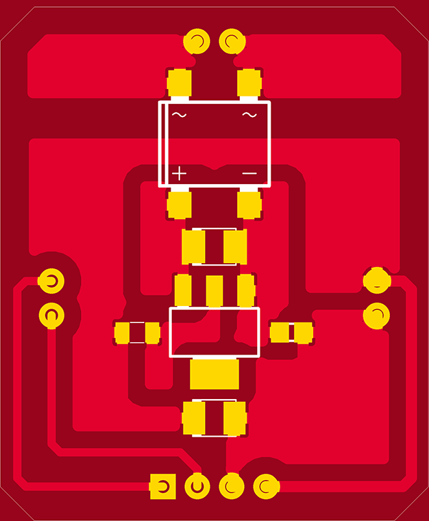

<h1 align="center"> LumiNode </h1>  

## Table of Contents
- [About](#about)
- [Bill of Materials](#bill-of-materials)
- [Social](#social)
- [License](#license)
- [Acknowledgments](#acknowledgments)

## About
A wireless multipurpose IoT (Internet of Things) compatible smart light system that can reproduce colour from any image in RGB colour space with intensity adjustment capability.
It is open-source and built for Arduino ecosystem making it suitable for hobbysist and beginners.

  &nbsp
  &nbsp

  &nbsp 
  &nbsp 

  &nbsp

## Bill of Materials

        1. Arduino Pro Mini
        2. 7805 Voltage regulator
        3. Bluetooth module HC-05
        4. 4 x 3528 RGB LEDs
        5. 4 x 100 to 330ohm resistors in 0805 package
        6. 1 x ULN2003 smd
        7. 1 x MMBT2N2222
        8. 1 x 1Kohm in 0805 package
        9. 4 x 330ohm in 1206 package
        10. 1 x M7 diode(1N4007 smd version) 
        11. 1W cool white smd LED
        12. PCB fabrication materials.
        13. Single core wires for soldering PTH holes.
        14. DBS107G - Bridge Rectifier
        15. 2 x 10K in 1206 package
        16. 2 x 100nF in 0805 package
        17. 1 x ferrite chip 0805 package(optional: pads can be shorted in PCB)
        18. 1 x 1A PTC 0805 package(optional: pads can be shorted in PCB
        

## Social
Connect us here:
  
  
 

 
or <a href ="https://github.com/SandeepanSengupta/Luminode/issues/new/">file an issue</a>. Feature requests are always welcome.

## License
Contents of this repository are realeased under [CC-BY-NC-SA 4.0](./LICENSE.md)  

## Acknowledgments
Thanks to the contributors! :wink:
